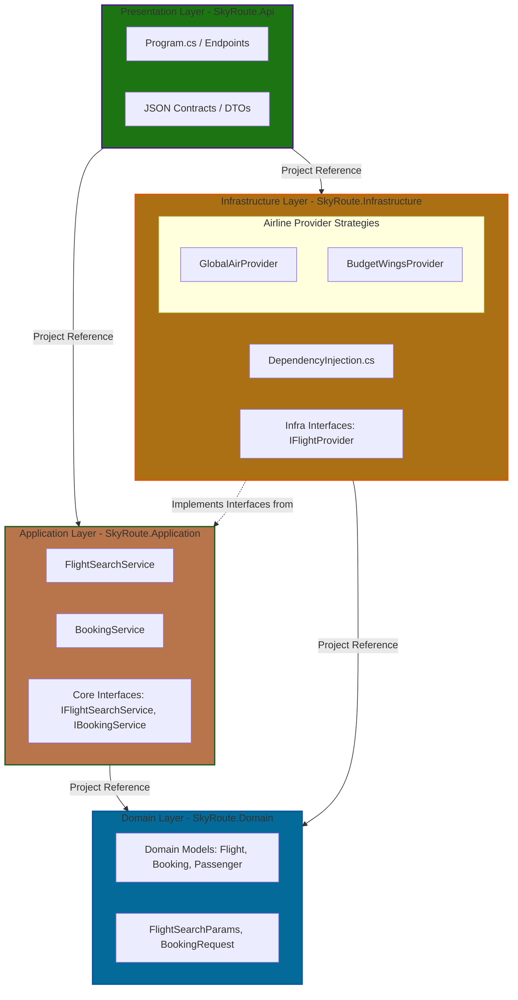

# SkyRouteChallenge

SkyRoute Challenge is a full-stack flight search and booking aggregator built with a decoupled Clean Architecture backend in .NET 10 and a reactive, standalone frontend in Angular 21

## Architectural Overview (Backend)

The backend strictly follows **Clean Architecture** principles, enforcing a unidirectional dependency flow toward the core business logic.



## Key Design Decisions

- Open/Closed Principle (OCP) via Strategy Pattern: External airline providers (GlobalAir, BudgetWings) are decoupled using the IFlightProvider abstraction. Introducing a new flight vendor requires zero modifications to the orchestration layer (FlightSearchService), achieving true extensibility.
- Polymorphic Pricing Engine: Rather than polluting the core services with rigid conditional switch statements or if-else blocks checking for provider names, pricing logic is encapsulated entirely within each concrete provider strategy.
- High-Performance Parallelism & Memory Streaming: Network API requests to independent providers are fired concurrently using Task.WhenAll. To avoid intermediary memory allocations and nested collection overhead, results are flattened in a single streaming pipeline using LINQ's SelectMany operator, achieving optimal $O(N \times M)$ linear complexity where $N$ is the negligible number of providers.
- Dependency Inversion (DIP) Boundary: Infrastructure-level interfaces (e.g., third-party search abstractions) are declared inside the Application layer. This design choice safeguards the Domain layer from infrastructure leaks, leaving it purely populated by POCO domain models and immutable value objects.

## Business Rules Implemented

1. Provider-Specific Pricing Calculations
- GlobalAir: Base Fare $+ 15\%$ fuel surcharge. The final price calculation is strictly rounded to two decimal places using standard accounting rounding criteria (MidpointRounding.AwayFromZero).
- BudgetWings: Base Fare $- 10\%$ promotional discount applied exclusively to the base fare. Safety guards are built-in to guarantee that the final price per passenger never drops below a hard threshold of $29.99.

2. Context-Aware UX & Validation Boundaries
- Domestic Routes: When checking flights inside the same origin country, the booking interface dynamically shifts form controls and validation rules to mandate a numeric-only National ID structure.
- International Routes: Cross-border routes automatically trigger passport validation requirements, replacing client-side labels with strict alphanumeric rules for Passport Numbers.

## Tech Stack & Versions

- Backend: .NET 8 Web API, Minimal Endpoints, LINQ.
- Frontend: Angular 21, Reactive Forms, Bootstrap 5 UI.

## Local Development Setup

To run the full stack locally for testing and verification purposes, open two separate instances of your terminal:

### Step 1: Run the Backend (.NET Web API)

- Navigate to the API entry point project directory:
```
cd SkyRouteChallenge/src/backend/SkyRoute.Api
```
- Restore packages and execute the server:
```
dotnet run
```
- The API will spin up locally. You can access the Swagger UI directly at http://localhost:5122/swagger to interact with raw endpoints.

### Step 2: Run the Frontend (Angular SPA)

- Navigate to the frontend directory:
```
cd SkyRouteChallenge/src/frontend
```
- Install the necessary project dependencies:
```
npm install
```
- Boot up the local development server:
```
ng serve
```
- Open your web browser and go to: http://localhost:4200

## Running the Ecosystem with Docker Compose

The entire monorepo is fully containerized, allowing you to spin up both the .NET 10 Backend API and the Angular 21 Frontend SPA simultaneously within isolated network environments. 

### Prerequisites
* Ensure you have **Docker** and **Docker Compose** installed on your machine.
* Verify that ports `5000` (Backend) and `4200` (Frontend) are not being utilized by other local services.

### Getting Started

1. **Navigate to the root directory** of the repository (`SkyRouteChallenge/`):
```bash
cd SkyRouteChallenge
```

2. Build and launch the containers in a single step:
```bash
docker compose up --build
```
This command will read the global context, fetch the official .NET 10 and Node 22 images, synchronize the SDK configurations, compile the backend, build the Angular production bundles, and serve them via an optimized Nginx instance.

3. Verify the running applications:
- Frontend Dashboard (Angular): Open your browser and navigate to http://localhost:4200
- Backend API Swagger Documentation: Access the live interactive documentation at http://localhost:5122/swagger

4. Maintenance & Troubleshooting Commands
If you make structural changes to your code or update NuGet/npm packages, use these commands to ensure a clean slate:
- Stop and tear down the environment:
```bash
docker compose down
```
- Force recreation without using stale cache (Recommended after config updates):
```bash
docker builder prune -f
docker compose up --build --force-recreate
```
- Inspect live container execution logs:
```bash
docker compose logs -f
```